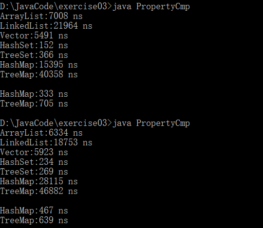
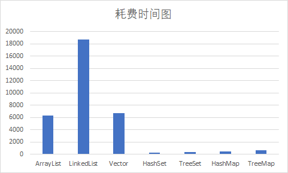
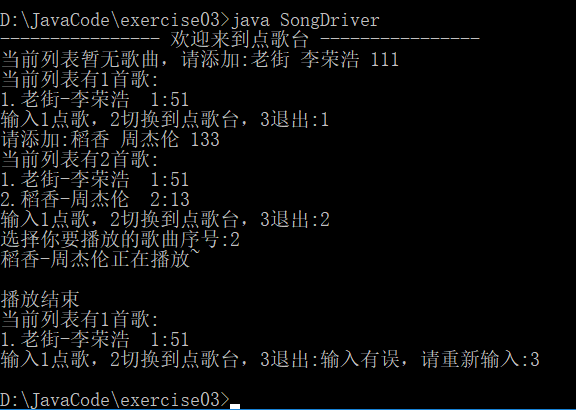

## 作业说明

> 包含内容：**ListTest.java**	测试List中的数赋给相同类型的数时是引用还是拷贝
>
> ​	**PropertyCmp.java**	对list,set,map等集合类的查找速度测试
>
> ​	**SongDriver.java**		一个简易的音乐点播台实现
>
> ​	


#### 一、ListTest.java运行结果

```java
ArrayList<Integer> list=new ArrayList<Integer>();
list.add(10);
Integer integer=list.get(0);
integer = 3;
System.out.println(list.get(0));
//输出结果为原值 10
//结论：把List中的成员赋给另一个变量时进行了拷贝，指向的是不同的地址
```

#### 二、PropertyCmp.java运行结果

> 运行环境：
>
> * 操作系统：Win10 教育版
> * CPU:apple:：  i5-4200H @2.8GHz
> * 内存:banana::    8g



```
单线程模式下查找性能测试 :
HashSet性能最好，LinkedList最低，性能较差的是ArrayList，其他表现均较好
Map分为HashMap和TreeMap，利用键值对进行查找才是其强项，如果直接contains判断其中键或值是否存在的话性能类似于LinkedList，因为其本质实现就是链表加数组

各个类具体的数据结构实现及性能分析以后进行补充
```

***一万个数据中找出一个所花费的时间对比***




#### 三、SongDriver.java运行结果



